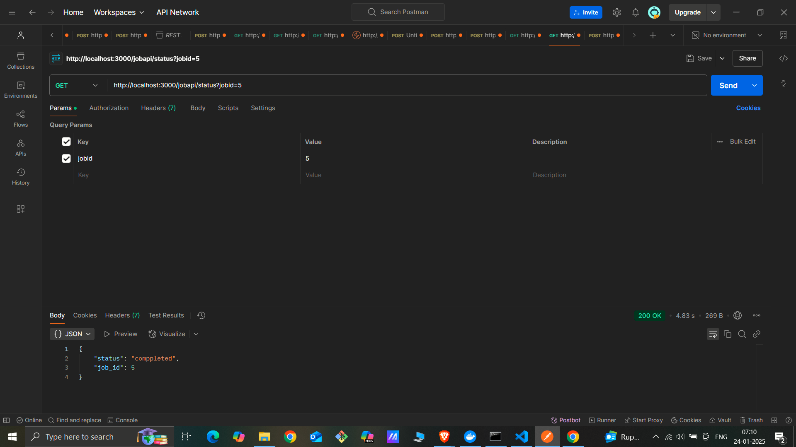
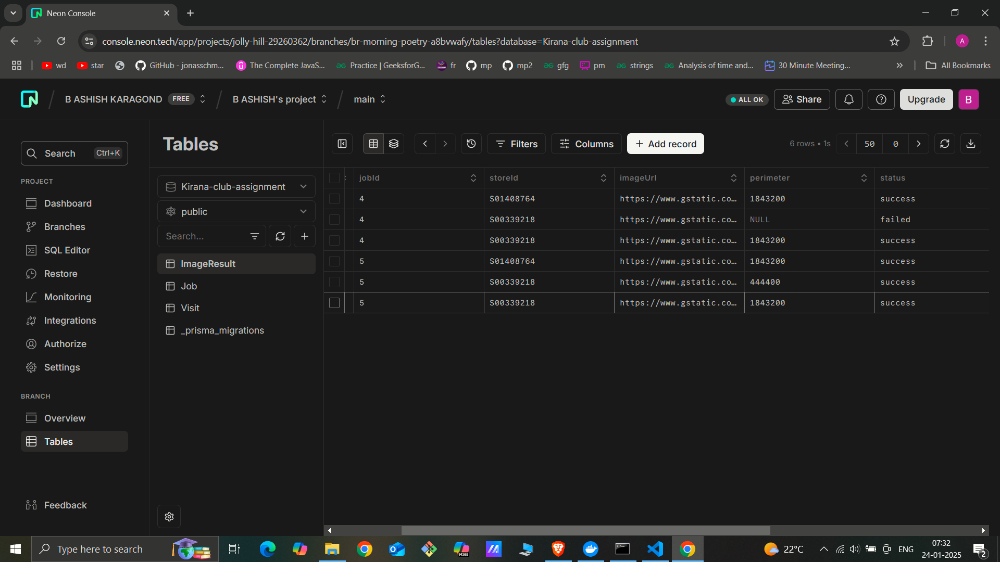

# Kirana Club Assignment


## Tech Stack
- Node.js
- Express.js
- TypeScript
- Redis
- Docker
- BullMQ
- PostgreSQL
- Prisma ORM


## Getting Started

Make sure you have the following installed on your system:
- Node.js (version 18 or later)
- Docker 
- A PostgreSQL database

- ### Installation For Local setup without docker compose

1. Clone the repository:
   ```bash
   git clone   https://github.com/ashish07-07/Kirana-club-Assignment.git
   cd Kirana-club-Assignment/backend
2) Install Dependencies
   ```
   npm install
3) Create a .env file in the backend directory with the following environment variables:

Run the Redis locally
4) ```bash

docker run --name redis -p 6379:6379 -d redis:6.2

5) ```
    DATABASE_URL=your_postgresql_database_url  You can also get the database link from neondb
6) Set up prisma
```bash
npx prisma generate
npx prisma migrate dev
```
7) ```
   npm run build


8) ```
   cd dist
   node index.js


Why I used BUllMQ- For Processing the job in order to put more burden on main server and maintaining the rule of first come first server (FIFO) Queue.

## Api 
1) To ad the job details and process the iamges 
```
http://localhost:3000/api/submit
```

This api is used for creating a job which includes details like count , visits and store details along with image url.

Added the Job to queue using Bullmq and screated a worker which processes this job one by one and updates the detail in database.


 
2)


```
http://localhost:3000/jobapi/status?jobid=1
```
This api is used to know the detials of the job wheather is it failed , passed or the processing is still ongoing

 
 This is for Failed status where i removed some image url links 
  
  When job id was not found
   


3) Data base Snapshots




   
   
   
 
   
